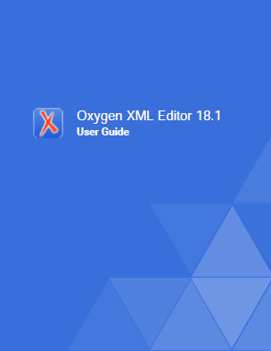

# Cover page customization

Cover page customizations is probably the first customization that you might 
want to implement because every company wants a custom design for the first page 
including product logo and title with custom fonts.

For oXygen user manual we have choosen a pretty simple design that presents 
the product logo and title drown over a custom background like in the next picture.

To implement this we have made the following customizations:

* **Logo and title** 
    
    Logo and title customization is implemented in the 
    *com.oxygenxml.pdf2.ug/Customization/fo/xsl/front-matter.xsl* stylesheet by 
    overriding the **createFrontCoverContents** template. 
    
    This template is used to generate a table with one row with two cells for product's logo
    and title.
* **Cover page background**

    This customization is implemented in the com.oxygenxml.pdf2.ug/Customization/fo/attrs/layout-masters-attr.xsl 
    stylesheet, see region-body__frontmatter.odd attribute set.
    
    This attribute set defines the **background-image** property for the **fo:region-body** associated with 
    the front cover page. To impose a fixed dimension to the background image we have used two 
    Apache FOP extensions **fox:background-image-width** and **fox:background-image-height**.
    
Declaring PDF2 plugin parameters to specify a certain product

This customization is used to generate three user manual distribution associated 
with the following products oXygen XML Editor, oXygen XML Author and oXygen XML Developer. 

Depending on the current published distribution, the logo and background images are different. 
Therefore, we need an XSLT parameter to identify the current published distribution.
In this scope, we've declared the oxy-ug-distribution parameter in the 
com.oxygenxml.pdf2.ug/Customization/fo/xsl/custom.xsl. 
To make visible this parameter for the DITA ANT process, we have to declare it in the 
com.oxygenxml.pdf2.ug/plugin.xml and also to use the dita.conductor.pdf2.param DITA PDF2 extension point.
http://www.dita-ot.org/1.8/dev_ref/plugin-xsltparams.html

Related informations:
[DITA-OT Adding parameters to existing XSLT steps](http://www.dita-ot.org/2.4/dev_ref/plugin-xsltparams.html)      
[XSL-FO fo:region-body formating object](https://www.w3.org/TR/xsl/#fo_region-body)
[XSL-FO Common Border, Padding, and Background Propertiess](https://www.w3.org/TR/xsl/#common-border-padding-and-background-properties)
