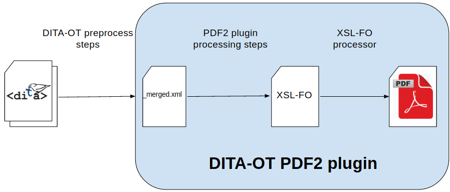

# Few words about DITA-OT PDF2 plugin

DITA-OT is an open-source publishing engine for XML content authored in the DITA. 
It takes a set of DITA files as input and transform them in various outputs like:
* HTML5 or XHTML
* PDF
* Eclipse Help
* Java Help

The DITA-OT has an extensible plug-in mechanism that allows you to add your own transformations 
and customize the default output.

The DITA-OT processor comes bundle with several plugins including the DITA-OT PDF2 plugin. 
Like the DITA-OT, the PDF2 plugin is implemented in Java, Ant and XSLT.  

The DITA to PDF transformation is multiple step transformation as you can see in the next diagram:

* DITA-OT pre-processing steps
  The pre-processing steps typically runs at the beginning of every DITA-OT 
  transformation. At the end, they produce mapname_merged.xml merged file 
  that includes all referenced topics. 
  You can read more about the pre-processing steps in the DITA-OT documentation 
  http://www.dita-ot.org/2.4/dev_ref/DITA-OTPreprocess.html

* PDF2 plugin processing steps

    These steps are converting the _merged.xml file to the topic.fo XSL-FO file. 
    These stepts are part of the PDF2 plugin and all of them are described in the 
    DITA-OT documentation: http://www.dita-ot.org/2.4/dev_ref/PdfDefault.html
     
    The most important step is transform.topic2fo.main that is an XSLT transformation.
    It takes as input the stage1.xml(an improved version of merged file that contain 
    DITA elements with additional information for TOC or index) 
    file and produces the stage2.fo. 
    This step is important because the majority of PDF customizations are XSLT 
    extensions for this transformation.

* XSL-FO to PDF step
    
    This step outputs the final PDF file by processing the topic.fo XSL-FO file. 
    There are three XSL-FO processor that you can use in this step:
    * Apache FOP
    * Antenna House 
    * RenderX XEP 

DITA-OT PDF2 transformation is composed from multiple substeps that 

DITA-OT processor

## DITA-OT PDF2 plugin

The DITA-OT is a DITA processor  

DITA-OT is a DITA processor 

* mapname_merged.xml merged file includes all referenced topics. 

Related links:
 
http://www.dita-ot.org/2.4/dev_ref/DITA-OTPreprocess.html
http://www.dita-ot.org/2.4/dev_ref/PdfDefault.html
