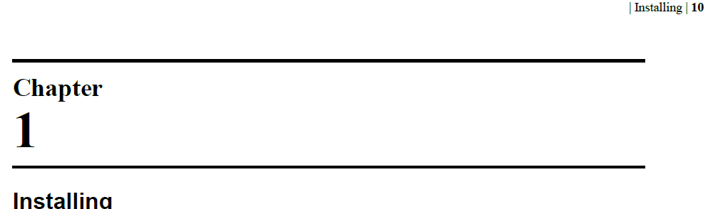

# Headers and footers

First of all, lets try to take a look over the default PDF generated by the DITA-OT 
without any customization.

We can see that the chapter's and and page number is generated on the page header, 
in the right part. First is displayed the chapter's title followed by the page number.
They are separated with a '|' character.

You can analyse the default implementation by looking into 
the org.dita.pdf2/xsl/fo/static-content.xsl stylesheet.

We'll customize the generation of the static content to:
* display the chapter's title and page number in the page footer;
* the chapter's title will be rendered in the left part and page number in the right part;  
* the chapter's title won't be displayed on chapter's first page bacause 
* it is already displayed.

You can view and analyse all these customizations in the by looking in the 
com.oxygenxml.pdf2.ug/Customization/fo/xsl/static-content.xsl stylesheet.

## Page numbering

By default, the PDF produced DITA-OT PDF2 transformation uses a double sided page numbering style. 
This means that chapters will alsways start on odd pages. 
Also, blank pages will be added in case when the number of pages for a chapter is even.

This behavior is useful when you want to print a PDF book, but it can be anoying 
when you use the PDF only to read with a PDF reader application.

This behavior is implemented in the XSL-FO by setting the **force-page-count="even"** 
attribute on the **fo:page-sequence** element.  

To see the default implementation search for **__force__page__count** attribute set
in the **org.dita.pdf2/cfg/fo/attrs/commons-attr.xsl** stylesheet.

In our customization we'll emit the **force-page-count** attribute 
to **auto**, case when no blank pages are emited. 
See implementation in Customization/fo/attrs/commons-attr.xsl.

## Reseting page numbering on first chapter
About the page numbering we want to use two different styles. 
In the first part of the user manual that includes the TOC, 
we want to use roman digits and after that we want to 
reset page numbering and use the arabic digits.

To reset the page numbers in XSL-FO, the initial-page-number attribute should be 
specified on the fo:page-sequence element. 
See the entire customization in the startPageNumbering template from the
com.oxygenxml.pdf2.ug/Customization/fo/xsl/commons.xsl stylesheet.

Related information:

* [XSL, XSL-FO FAQ, Page Numbering] (http://www.dpawson.co.uk/xsl/sect3/N8703.html)
 